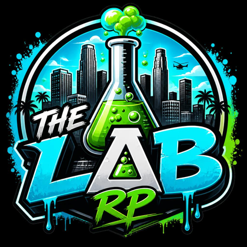

# Welcome to The Lab

The Lab is a **semi-serious** roleplay city. We want real, immersive stories, but we're not here to ruin your night over a slip of the tongue. You won't get banned for accidentally breaking character or saying something OOC once or twice while you find your feet.

What we ask in return is simple: **take the RP seriously, and value your character's life.** Play like your character is a real person: someone who wants to survive, reacts to danger, and lives with the consequences of their choices. That one mindset prevents most problems before a rule ever has to be quoted.

> **The one-line version:** Be immersive, value your life, and treat people well OOC. Get those three right and you'll rarely think about the rulebook at all.

## How to read this book

* Everyone should read [How We Handle Rules](how-we-handle-rules.md) and [The Golden Rules](golden-rules.md).
* Know the lines that have no second chances: [Zero Tolerance](zero-tolerance.md).
* The rest, like combat, death, and metagaming, is detail you can reference when a situation comes up.

We would rather coach a new player into a great community member than ban them. The rules exist to protect everyone from the small number of people who show up to cheat, grief, or hurt others, not to punish people for learning.
